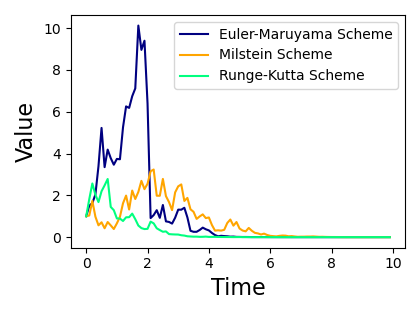
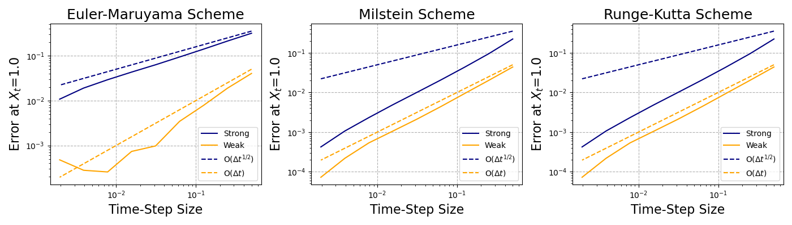
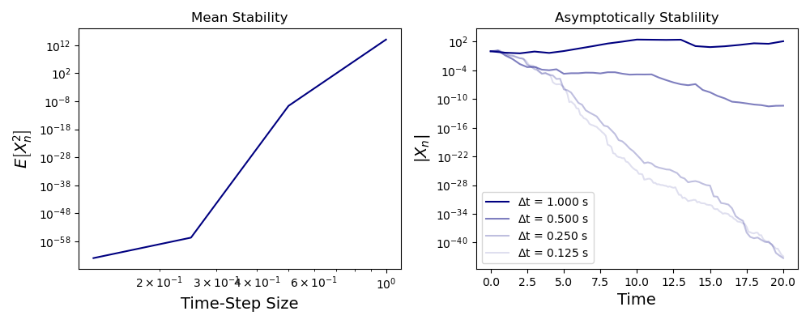

# Numerical Solution of Geometric Brownian Motion
***Numerical Analysis***
---

As for the geometric Brownian motion，
$$
\begin{aligned}
&\mathrm{d}\mathbf{X}=\mu\mathbf{X}\mathrm{d}t+\sigma\mathbf{X}\mathrm{d}\mathbf{W}\\
&\mathbf{X}(0)=\mathbf{X_0}
\end{aligned}
$$
we can write down its analytical solution with the help of Ito formula, as
$$
\mathbf{X}(t)=\mathbf{X}_0\exp\left((\mu-\frac{1}{2}\sigma^2)t+\sigma\mathbf{W}(t)\right)
$$
But here, we want to study the numerical solution of geometric Brownian motion, and investigate how different numerical scheme would affect the convergence and stability of the solution.

---

#### Use Euler-Maruyama scheme, Milstein scheme, and Runge-Kutta scheme to solve the following SDE.

Here we take 
$$
\mu=-\frac{1}{2},\quad\sigma=1,\quad\mathbf{X}_0=1.
$$
And we solve it using three differetn numerical scheme.

- Euler-Maruyama Scheme:
$$
X(t+dt)=X(t)+\mu X(t) dt+\sigma X(t)dW
$$
  Where $dW\sim N(0,dt)$.

- Milstein Scheme:
$$
X(t+dt)=X(t)+\mu X(t) dt+\sigma X(t)dW + \frac{1}{2}\sigma^2X(t)(dW^2-\Delta t)
$$

- Runge-Kutta Scheme:
$$
\begin{aligned}
\hat{X}(t) &= X(t)+\sigma X_(t)\sqrt{dt}\\
X(t+dt)&=X(t)+\mu X(t) dt+\sigma X(t)dW + \frac{\sigma}{2\sqrt{dt}}(\hat{X}(t)-X(t))(dW^2- dt)
\end{aligned}
$$

Here, we take $\mathrm{d}t = 0.1$, and total simulation time $T=10$. The numerical trace of Brownian motion for each scheme is shown below.

---

#### Show numerically the strong and weak convergence orders of the three schemes

|  Theorem  | Strong Order | Week Order |
|-----------|--------------|------------|
|E-M        |           1/2|           1|
|Milstein   |             1|           1|
|Runge-Kutta|             1|           1|

Then, we are going to verify the strong and weak convergence rate of each scheme. According to the definition, we have

- **Strong Convergence:**

  $Y_n^{\Delta t}$ converges strongly to $X_t$ at times $\{t_n\}$ on $[0,T]$ with order $\alpha$, if there exits constants $c>0$, $\delta_0>0$, independent of $\Delta t$, s.t.,
$$
\max_{0\leq t\leq T}E\left|Y_n^{\Delta t}-X_{t_n}\right|\leq C\Delta t^\alpha, \quad\forall0<\Delta t<\delta_o
$$
  where $\alpha$ is the strong convergence rate.

- **Weak Convergence:**

  $Y_n^{\Delta t}$ converges weakly to $X_t$ at times $\{t_n\}$ on $[0,T]$ with order $\beta$, if there exits constants $c>0$, $\delta_0>0$, independent of $\Delta t$, s.t.,
$$
\max_{0\leq t\leq T}\left|EY_n^{\Delta t}-EX_{t_n}\right|\leq C\Delta t^\beta,\quad\forall0<\Delta t<\delta_o
$$
  where $\alpha$ is the strong convergence rate.

The numerical convergence results are show below, which exactly fits the statement in theorem.

---

#### Study numerically how time step changes the mean-square stability and the asymptotic stability of the Euler-Maruyama scheme

According to the definition of stochastic stability, we study the mean square stability and asymptotic stability of our Browian motion system, respectively.

- Mean Square Stability:

$$
\lim_{n\to\infty}E\left[X_n^2\right]=0
$$

- Asymptotic Stability:
$$
P\left(\lim_{t\to\infty}\left|X_t\right|=0\right)=1
$$

To ensure the existency of stochastic stability theoretically, we take $\mu=-3, \sigma=1$. And we take $\Delta t= \{1, 0.5, 0.25, 0.125\}$, respectively, and plot the mean square value of $X_n$ as funciton of $dt$.  Theoretically speaking, as long as
$$
\Delta t<-\frac{\sigma^2+2\mu}{\mu^2} = \frac{5}9
$$
we can ensure the mean square stability, which fits the numerical results in the figure.
